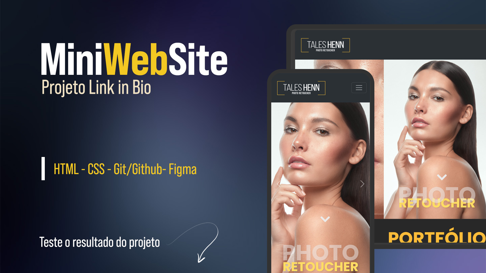

<h1 align="center">Mini Web Site</h1>

Clone do meu website para fins de estudo sobre HTML e CSS puros.  
<a href="https://linkinbio-v1-tales-projects-6149a15d.vercel.app/">Veja aversão dele funcionando aqui!</a>

  <a href="#-tecnologias">Tecnologias</a>&nbsp;&nbsp;&nbsp;|&nbsp;&nbsp;&nbsp;
  <a href="#-projeto">Projeto</a>&nbsp;&nbsp;&nbsp;|&nbsp;&nbsp;&nbsp;
  <a href="#-layout">Layout</a>&nbsp;&nbsp;&nbsp;|&nbsp;&nbsp;&nbsp;
  <a href="#memo-licença">Licença</a>

  

 

  

## 🚀 Tecnologias

Esse projeto foi desenvolvido com as seguintes tecnologias:

- HTML e CSS
- Git e Github
- Figma

## 💻 Projeto

O Mini Web Site é um agregador de links para usar como cartão de visitas em redes sociais que permitem adicionar links na bio.

- [Acesse o projeto finalizado, online](https://linkinbio-v1-tales-projects-6149a15d.vercel.app/)

## 🔖 Layout

Você pode visualizar o layout do projeto através [DESSE LINK](https://www.figma.com/design/GHKokKgs0Vo8FQvBbu27jw/mini-landPage-editavel?node-id=1-6&m=dev&t=FD6yV90JE2bw4pJg-1). É necessário ter conta no [Figma](https://figma.com) para acessá-lo.

## 📝 Licença

Esse projeto está sob a licença MIT.

---

Feito com ♥ by Tales Henn 📩 [Contate me por e-mail](mailto:contato@taleshenn.com.br)
